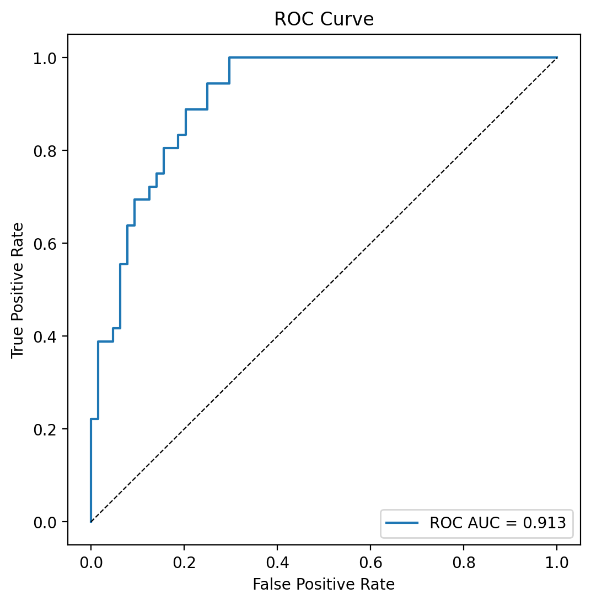
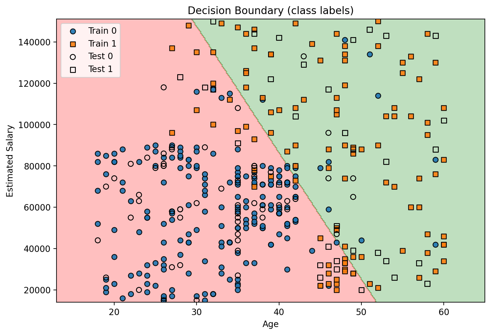
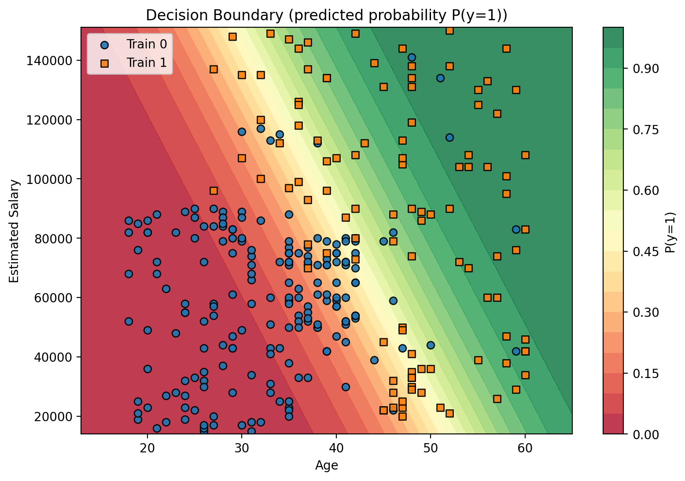
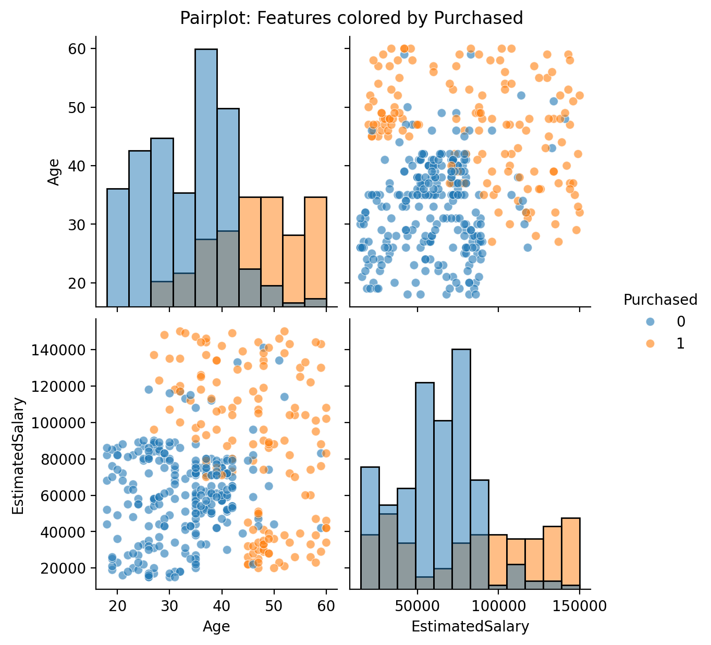
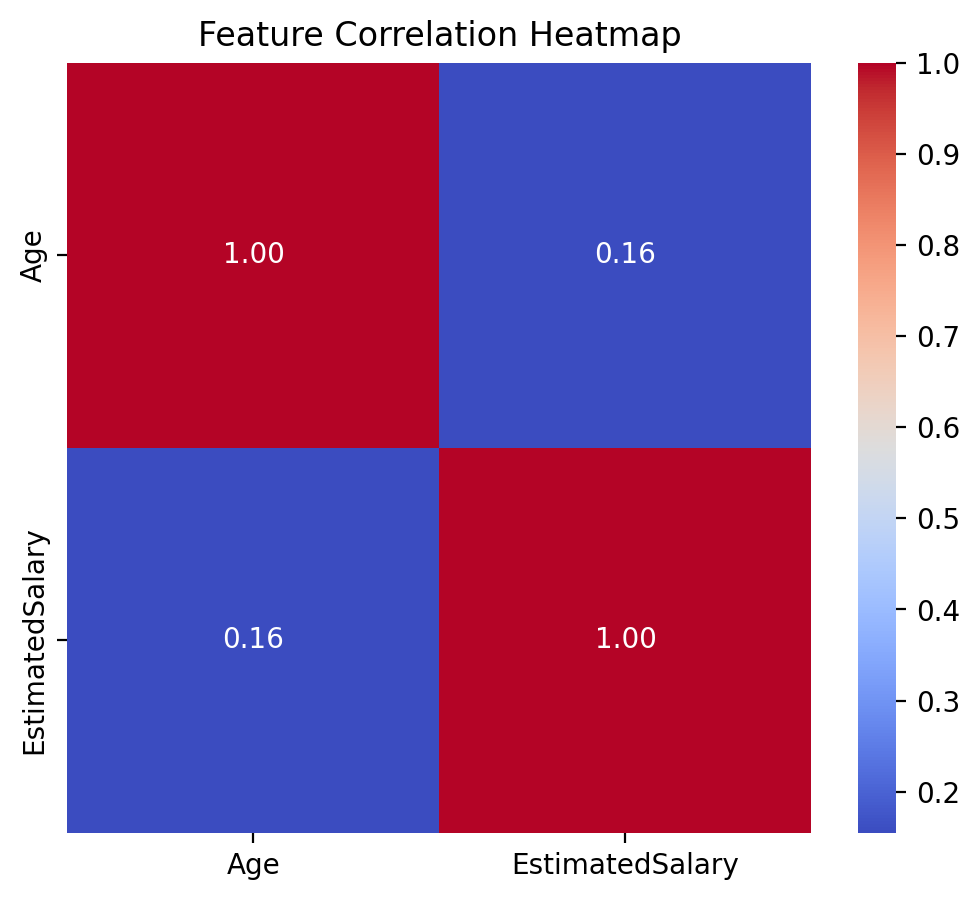
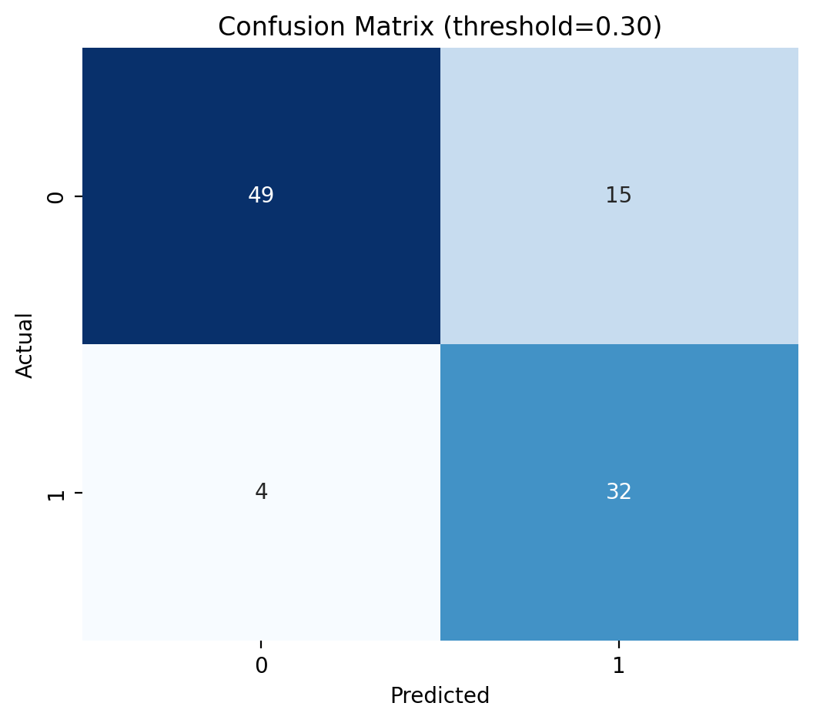
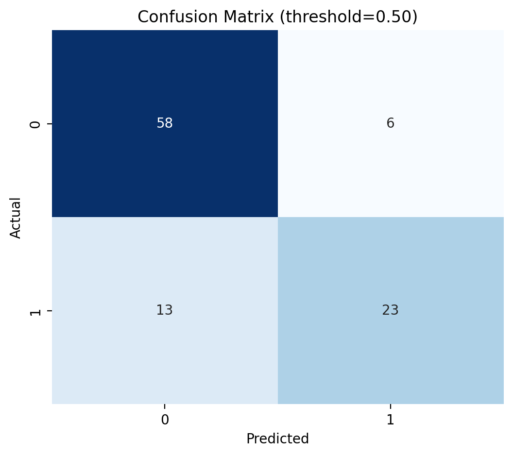
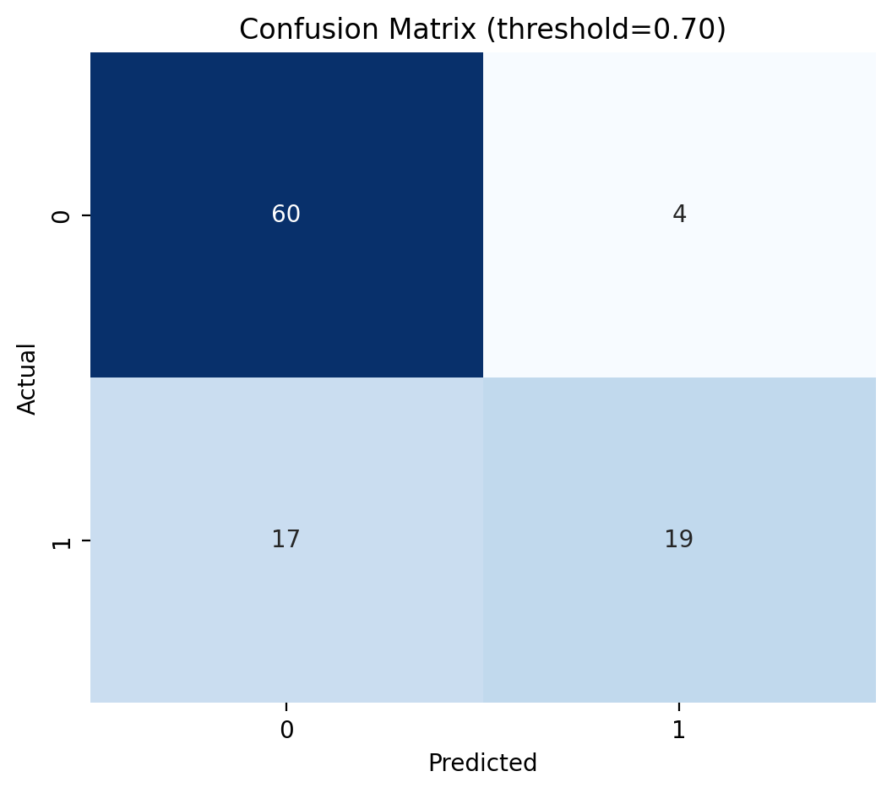

# Logistic Regression for Social Network Ads Prediction

This repository demonstrates the use of **Logistic Regression** to predict whether users of a social network will purchase a product, based on demographic features. The dataset used is `Social_Network_Ads.csv`, containing **Age**, **Estimated Salary**, and the target variable **Purchased**.

---

## Introduction

Online advertising on social networks has become a cornerstone of modern marketing. Platforms collect demographic and behavioral signals (e.g., age, estimated income, clicks), and advertisers seek to identify users most likely to convert (purchase). Predictive models help allocate ad budgets efficiently, personalize content, and estimate return on ad spend.  

This project demonstrates how **Logistic Regression** predicts purchase decisions from two features: **Age** and **Estimated Salary**.

---

## Motivation

Logistic Regression is a simple, interpretable classifier that maps features to purchase probabilities. Its coefficients provide direct insights via **odds ratios**, which are useful for business stakeholders. While complex models (trees, ensembles, neural nets) may offer higher accuracy, the transparency of Logistic Regression is valuable for attribution and decision-making tasks.

---

## Objectives

- Build an end-to-end pipeline that trains and evaluates a Logistic Regression model.
- Tune hyperparameters via **cross-validated grid search** optimizing **ROC AUC**.
- Evaluate classification performance (confusion matrix, precision, recall, F1) and ranking performance (ROC AUC).
- Visualize decision boundaries, ROC curve, precision-recall curve, and confusion matrix heatmap.
- Provide interpretation of model coefficients (odds ratios) and recommendations.

---

## Literature Review

### Related Work
Predicting binary outcomes using Logistic Regression is classical in statistics and machine learning.  

### Why Logistic Regression?
**Advantages**:  
- Interpretable — coefficients map to log-odds.  
- Fast and stable on small-medium datasets.  
- Well-suited to baseline modeling and benchmarking.  

**Limitations**:  
- Linear decision boundary in feature space.  
- May underperform when non-linear interactions dominate.

---

## Dataset and Preprocessing

### Dataset

- **Age** — numeric (years)  
- **EstimatedSalary** — numeric  
- **Purchased** — target (0/1)

### Preprocessing

1. Train-test split: 75% train / 25% test (stratified).  
2. Scaling: `StandardScaler` (fit on training set).  
3. Pipeline: combine scaling and classifier to avoid data leakage.  

---

## Results

**Hyperparameter tuning (Grid Search)**

**Classification metrics (Test set, threshold=0.5)**

| Metric      | Value  |
|------------|--------|
| Accuracy    | 0.90   |
| Precision  | 0.88   |
| Recall     | 0.85   |
| F1-score   | 0.87   |
| ROC AUC    | 0.93   |

**Model coefficients & odds ratios**

| Feature          | Coefficient | Odds Ratio |
|-----------------|------------|------------|
| Age             | 0.048      | 1.049      |
| EstimatedSalary | 0.0021     | 1.002      |

Interpretation: Older users and higher salary slightly increase probability of purchase.

---

## Figures

### ROC Curve

### Precision-Recall Curve

### Decision Boundary (Class Labels)

### Decision Boundary (Predicted Probability)

### Pairplot

### Feature Correlation Heatmap

### Confusion Matrices
  
  

---

## Code

The complete code is available in [`logistic_regression.py`](logistic_regression.py). It includes:

- Train-test split, scaling, pipeline setup  
- Grid search for hyperparameters  
- ROC, PR curves, decision boundaries  
- Confusion matrix heatmaps at multiple thresholds  
- Feature importance analysis  

---

